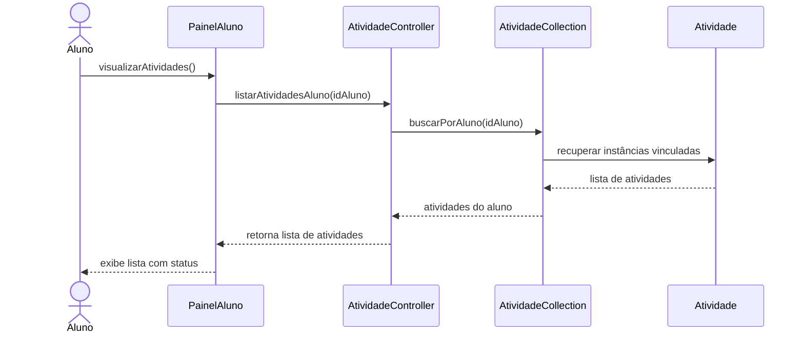

### UC.06 - Ver Lista de Atividades Vinculadas (Aluno)

```mermaid
sequenceDiagram
    actor Aluno
    participant PainelAluno
    participant AtividadeController
    participant AtividadeCollection
    participant Atividade

    Aluno->>PainelAluno: visualizarAtividades()
    PainelAluno->>AtividadeController: listarAtividadesAluno(idAluno)
    AtividadeController->>AtividadeCollection: buscarPorAluno(idAluno)
    AtividadeCollection->>Atividade: recuperar instâncias vinculadas
    Atividade-->>AtividadeCollection: lista de atividades
    AtividadeCollection-->>AtividadeController: atividades do aluno
    AtividadeController-->>PainelAluno: retorna lista de atividades
    PainelAluno-->>Aluno: exibe lista com status
```

