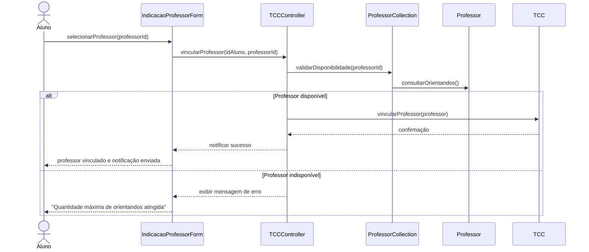

### UC.07 - Solicitar Professor (Aluno)

```mermaid
sequenceDiagram
    actor Aluno
    participant IndicacaoProfessorForm
    participant TCCController
    participant ProfessorCollection
    participant Professor
    participant TCC

    Aluno->>IndicacaoProfessorForm: selecionarProfessor(professorId)
    IndicacaoProfessorForm->>TCCController: vincularProfessor(idAluno, professorId)

    TCCController->>ProfessorCollection: validarDisponibilidade(professorId)
    ProfessorCollection->>Professor: consultarOrientandos()
    alt Professor disponível
        TCCController->>TCC: vincularProfessor(professor)
        TCC-->>TCCController: confirmação
        TCCController-->>IndicacaoProfessorForm: notificar sucesso
        IndicacaoProfessorForm-->>Aluno: professor vinculado e notificação enviada
    else Professor indisponível
        TCCController-->>IndicacaoProfessorForm: exibir mensagem de erro
        IndicacaoProfessorForm-->>Aluno: "Quantidade máxima de orientandos atingida"
    end
```

