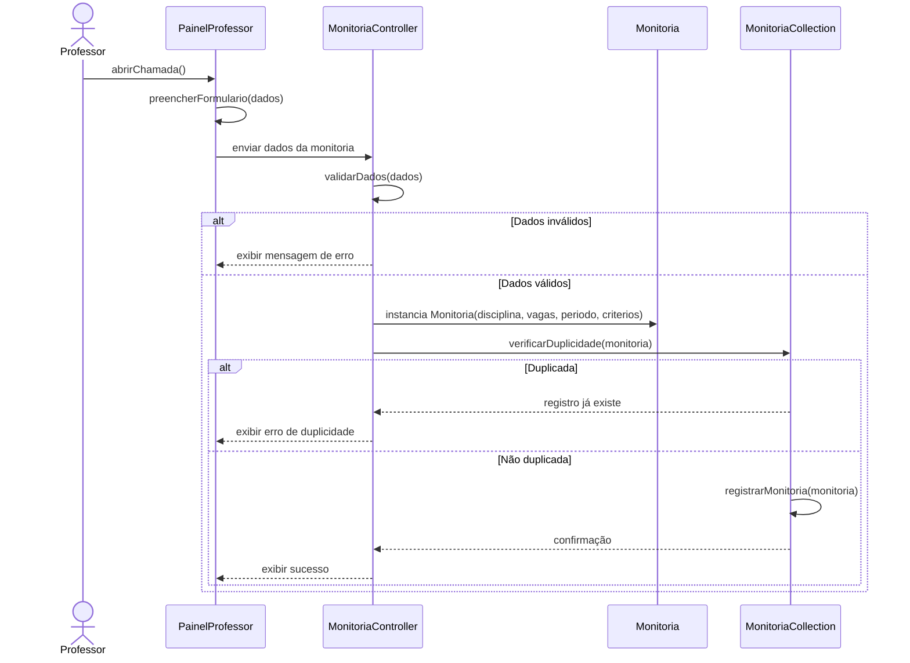

### UC.25 - Abrir Monitoria (Professor)

```mermaid
sequenceDiagram
    actor Professor
    participant PainelProfessor
    participant MonitoriaController
    participant Monitoria
    participant MonitoriaCollection

    Professor->>PainelProfessor: abrirChamada()
    PainelProfessor->>PainelProfessor: preencherFormulario(dados)
    PainelProfessor->>MonitoriaController: enviar dados da monitoria

    MonitoriaController->>MonitoriaController: validarDados(dados)
    alt Dados inválidos
        MonitoriaController-->>PainelProfessor: exibir mensagem de erro
    else Dados válidos
        MonitoriaController->>Monitoria: instancia Monitoria(disciplina, vagas, periodo, criterios)
        MonitoriaController->>MonitoriaCollection: verificarDuplicidade(monitoria)
        alt Duplicada
            MonitoriaCollection-->>MonitoriaController: registro já existe
            MonitoriaController-->>PainelProfessor: exibir erro de duplicidade
        else Não duplicada
            MonitoriaCollection->>MonitoriaCollection: registrarMonitoria(monitoria)
            MonitoriaCollection-->>MonitoriaController: confirmação
            MonitoriaController-->>PainelProfessor: exibir sucesso
        end
    end
```

